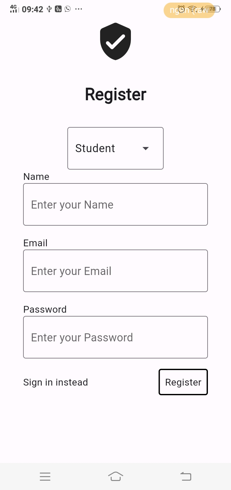
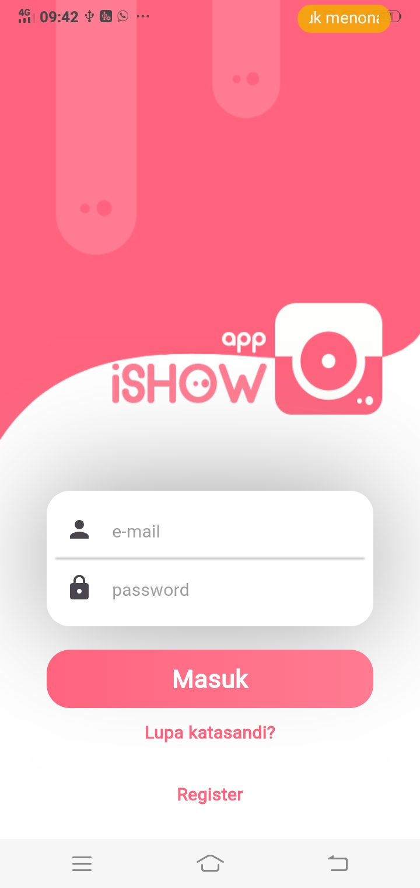
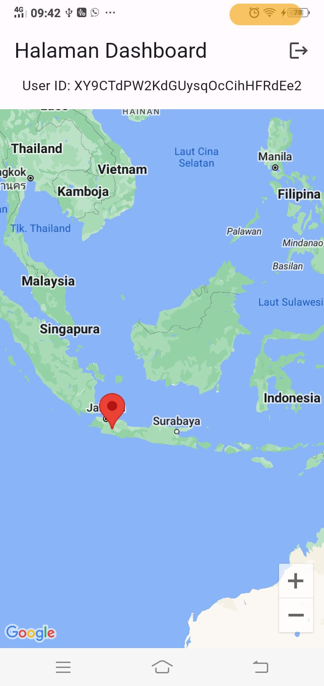

# EduConnect App 

EduConnect is an innovative platform dedicated to addressing the global challenge of "Quality Education." It focuses on real-time insights into the educational landscape by providing comprehensive information on the number of educators in each school. The aim is to bridge the educational resource gap and ensure equal access to quality education for all.

## Team

*Basreng* team consist of
- Danny Suggi Saputra <<dannysaputra3003@gmail.com>> (Hustler)
- Muhammad Azhari <<azharumuhammad@gmail.com>> (Hacker)
- Devi Mulyana <<jangebe91@gmail.com>> (Hacker)
- Syadda Abdullah <<ssyyaaddddaa@gmail.com>> (Hipster)

## Hacker 2nd Submission

- Register Page

- Login Page

- Map Page

## Getting Started

This project is a starting point for a Flutter application.

A few resources to get you started if this is your first Flutter project:

- [Lab: Write your first Flutter app](https://docs.flutter.dev/get-started/codelab)
- [Cookbook: Useful Flutter samples](https://docs.flutter.dev/cookbook)

For help getting started with Flutter development, view the
[online documentation](https://docs.flutter.dev/), which offers tutorials,
samples, guidance on mobile development, and a full API reference.

